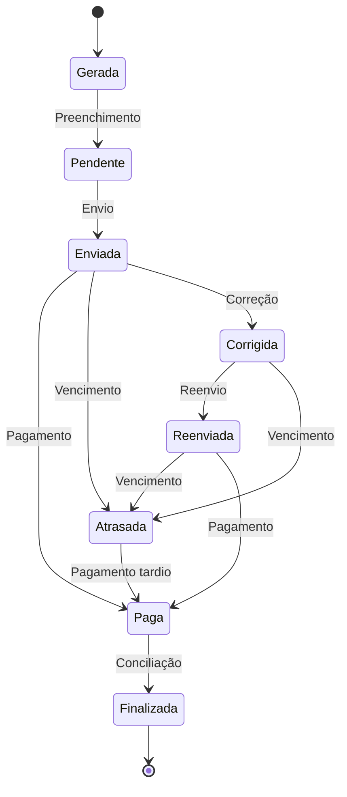

# Processo de Faturamento

## Visão Geral

O processo de faturamento no Sistema Solar Energy gerencia o ciclo completo de faturamento dos cooperados, aplicando descontos nas contas de energia e controlando o fluxo de pagamentos.

## Conceitos Fundamentais

### Unidade Beneficiária
- Ponto de consumo de energia do cooperado
- Número da UC (Unidade Consumidora)
- Percentual de desconto contratado
- Histórico de consumo médio

### Fatura
- Valores da fatura da concessionária
- Aplicação do desconto acordado
- Valor de assinatura (remuneração da cooperativa)
- Status de pagamento
- Controle de vencimento

### Ciclo de Vida da Fatura



## Regras de Negócio

### Cálculo do Desconto
```
valor_desconto = (total_fatura - iluminacao_publica - outros_valores) * (percentual_desconto / 100)
```

### Cálculo do Valor de Assinatura
```
valor_assinatura = total_fatura - valor_desconto - fatura_concessionaria
```

### Regras de Vencimento
- Data padrão: dia 10 do mês (configurável)
- Fatura considerada atrasada após o vencimento
- Possibilidade de extensão de prazo com justificativa

## Processo Operacional

### 1. Geração Mensal
- **Responsáveis**: Sistema / Administrador
- **Entradas**: Unidades beneficiárias ativas
- **Saídas**: Faturas com status "gerada"
- **Verificações**: Unidades ativas, mês não duplicado, mês não futuro

### 2. Preenchimento
- **Responsáveis**: Operador
- **Entradas**: Conta de energia original, dados de consumo
- **Saídas**: Fatura com status "pendente"
- **Verificações**: Consumo coerente, valores positivos, anexo de comprovante

### 3. Envio
- **Responsáveis**: Operador / Sistema
- **Meios**: Email, WhatsApp, Portal do cooperado
- **Saídas**: Fatura com status "enviada"

### 4. Acompanhamento de Pagamento
- **Responsáveis**: Operador financeiro
- **Entradas**: Comprovantes, dados bancários
- **Verificações**: Valor correto, data de pagamento, dados do cooperado

### 5. Conciliação
- **Responsáveis**: Gestor financeiro
- **Saídas**: Faturas com status "finalizada"
- **Relatórios**: Inadimplência, total faturado, descontos aplicados

## Integrações

### Financeiro
- Geração automática de lançamentos ao criar fatura
- Atualização de status financeiro com confirmação de pagamento

### Cooperados
- Visualização do histórico de faturas
- Estatísticas de consumo e economia

### Pagamentos
- Vinculação entre faturas e pagamentos de usina
- Rateio proporcional de custos

## Relatórios e Análises

### Operacionais
- Faturas por status
- Faturas vencidas
- Cooperados inadimplentes

### Gerenciais
- Faturamento mensal
- Descontos aplicados
- Valor médio de economia por cooperado

### Estratégicos
- Rentabilidade por cooperado
- Evolução de consumo
- Sazonalidade de pagamentos

## Gestão de Problemas

### Correção de Faturas
1. Operador corrige valores da fatura
2. Sistema atualiza status para "corrigida"
3. Fatura é reenviada ao cooperado

### Tratamento de Inadimplência
1. Sistema marca fatura como "atrasada"
2. Envio de notificação de atraso
3. Acompanhamento de contato

### Estorno e Cancelamento
1. Registro de motivo
2. Autorização de gestor
3. Execução da operação

## Indicadores de Performance (KPIs)
- **Tempo médio de preenchimento**: Tempo entre geração e envio
- **Taxa de inadimplência**: Percentual de faturas atrasadas
- **Tempo médio de pagamento**: Dias entre envio e pagamento
- **Economia média proporcionada**: Valor médio de desconto

## Automações Implementadas
- Notificações automáticas de vencimento e atraso
- Atualização de status baseada em regras temporais
- Cálculos automáticos de desconto e assinatura

## Próximas Melhorias
1. Integração com gateway de pagamento
2. IA para previsão de inadimplência
3. Importação automática de dados da concessionária
4. Personalização de templates de faturas
