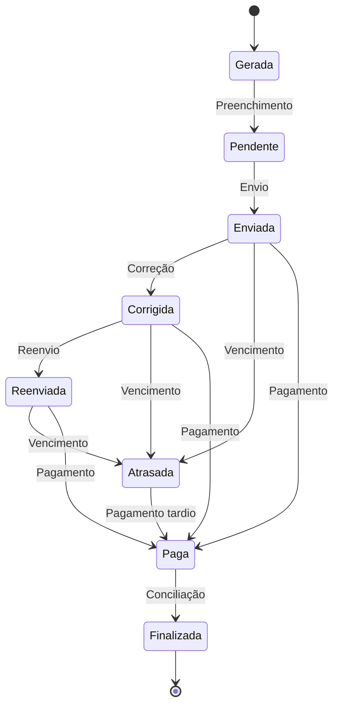

# Processo de Faturamento

## Visão Geral

O processo de faturamento no Sistema Solar Energy gerencia o ciclo completo de faturamento dos cooperados, aplicando os descontos acordados nas contas de energia e controlando o fluxo de pagamentos.

## Conceitos Fundamentais

### 1. Unidade Beneficiária

Representa o ponto de consumo de energia do cooperado, com as seguintes características:
- Número da UC (Unidade Consumidora)
- Percentual de desconto contratado
- Histórico de consumo médio
- Endereço completo

### 2. Fatura

Representa a cobrança mensal ao cooperado, contendo:
- Valores da fatura da concessionária
- Aplicação do desconto acordado
- Valor de assinatura (remuneração da cooperativa)
- Status de pagamento
- Controle de vencimento

### 3. Ciclo de Vida da Fatura



## Regras de Negócio

### 1. Cálculo do Desconto

O desconto é aplicado sobre o valor da energia, excluindo taxas como iluminação pública:

```
valor_desconto = (total_fatura - iluminacao_publica - outros_valores) * (percentual_desconto / 100)
```

### 2. Cálculo do Valor de Assinatura

O valor de assinatura representa a remuneração da cooperativa:

```
valor_assinatura = total_fatura - valor_desconto - fatura_concessionaria
```

### 3. Regras de Vencimento

- Data de vencimento padrão: dia 10 do mês (configurável)
- Fatura considerada atrasada após o vencimento
- Possibilidade de extensão de prazo sob justificativa

### 4. Geração de Faturas

- Geração automática no início do mês
- Geração sob demanda permitida
- Geração em lote para todas unidades ativas

## Processo Operacional

### 1. Geração Mensal

**Atividade**: Geração automática de faturas no início do mês
**Responsáveis**: Sistema / Administrador
**Entradas**: Unidades beneficiárias ativas
**Saídas**: Faturas com status "gerada"
**Verificações**:
- Unidades beneficiárias ativas
- Mês/ano não duplicado
- Mês não futuro

### 2. Preenchimento

**Atividade**: Preenchimento dos dados de consumo e valores
**Responsáveis**: Operador
**Entradas**: Conta de energia original, dados de consumo
**Saídas**: Fatura com status "pendente"
**Verificações**:
- Consumo coerente com histórico
- Valores positivos
- Upload do arquivo da concessionária

### 3. Envio

**Atividade**: Envio da fatura ao cooperado
**Responsáveis**: Operador / Sistema
**Entradas**: Fatura pendente
**Saídas**: Fatura com status "enviada"
**Meios de Envio**:
- Email
- WhatsApp
- Portal do cooperado

### 4. Acompanhamento de Pagamento

**Atividade**: Monitoramento dos pagamentos e vencimentos
**Responsáveis**: Operador financeiro
**Entradas**: Comprovantes, dados bancários
**Saídas**: Faturas com status atualizado
**Verificações**:
- Valor correto
- Data de pagamento
- Dados do cooperado

### 5. Conciliação

**Atividade**: Fechamento mensal dos pagamentos
**Responsáveis**: Gestor financeiro
**Entradas**: Faturas pagas
**Saídas**: Faturas com status "finalizada"
**Relatórios**:
- Inadimplência
- Total faturado
- Total de descontos aplicados

## Integrações

### 1. Financeiro

- Geração automática de lançamento financeiro ao criar fatura
- Atualização de status financeiro ao confirmar pagamento

### 2. Cooperados

- Visualização do histórico de faturas
- Estatísticas de consumo e economia

### 3. Pagamentos

- Vinculação entre faturas de cooperados e pagamentos de usina
- Rateio proporcional de custos

## Relatórios e Análises

### 1. Relatórios Operacionais

- Faturas por status
- Faturas vencidas
- Cooperados inadimplentes

### 2. Relatórios Gerenciais

- Faturamento mensal
- Descontos aplicados
- Valor médio de economia por cooperado
- Projeção de receita

### 3. Relatórios de Decisão

- Rentabilidade por cooperado
- Evolução de consumo
- Sazonalidade de pagamentos

## Gestão de Problemas

### 1. Correção de Faturas

**Cenário**: Erro identificado após envio da fatura
**Processo**:
1. Operador corrige valores da fatura
2. Sistema atualiza status para "corrigida"
3. Fatura é reenviada ao cooperado

### 2. Tratamento de Inadimplência

**Cenário**: Fatura não paga após vencimento
**Processo**:
1. Sistema marca fatura como "atrasada"
2. Envio de notificação de atraso
3. Acompanhamento de contato
4. Registro de acordos

### 3. Estorno e Cancelamento

**Cenário**: Necessidade de estorno ou cancelamento
**Processo**:
1. Registro de motivo
2. Autorização de gestor
3. Execução da operação
4. Documento comprobatório

## Considerações Especiais

### 1. Sazonalidade

- Consumo tipicamente maior em meses quentes
- Planejamento para variações sazonais

### 2. Reajustes Tarifários

- Atualização de percentuais de desconto
- Comunicação prévia aos cooperados

### 3. Casos Especiais

- Tratamento para cooperados de grande porte
- Condições específicas acordadas em contrato

## Indicadores de Performance (KPIs)

- **Tempo médio de preenchimento**: Tempo entre geração e envio
- **Taxa de inadimplência**: Percentual de faturas atrasadas
- **Tempo médio de pagamento**: Dias entre envio e pagamento
- **Economia média proporcionada**: Valor médio de desconto
- **Satisfação com processo**: Pesquisa com cooperados

## Automações

- **Notificações automáticas**: Vencimento próximo, atraso
- **Atualização de status**: Base em regras temporais
- **Cálculos automáticos**: Desconto, assinatura, economia
- **Geração de documentos**: Demonstrativos, recibos

## Próximas Melhorias

1. **Integração com gateway de pagamento**: Pagamento online direto
2. **IA para previsão de inadimplência**: Modelo preditivo
3. **Importação automática de dados**: Leitura de PDFs de concessionárias
4. **Personalização de faturas**: Templates configuráveis
5. **App mobile**: Visualização e pagamento via aplicativo
