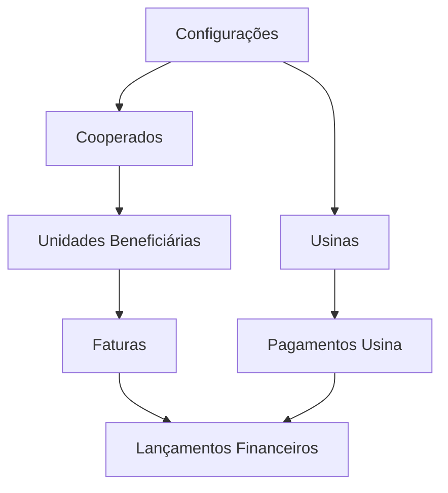

# Módulos do Sistema

O sistema Solar Energy é dividido em módulos funcionais que atendem a diferentes aspectos da gestão de usinas fotovoltaicas e assinantes de energia por assinatura. Esta seção documenta cada módulo, suas funcionalidades principais e como eles se integram.

## Estrutura Modular

O sistema segue uma arquitetura modular com os seguintes componentes principais:

## 1. [Cooperados](./cooperados.md)

O módulo de Cooperados gerencia os clientes assinantes de energia, incluindo:

* Cadastro e gestão de cooperados (pessoas físicas e jurídicas)
* Gestão de unidades beneficiárias (pontos de consumo)
* Controle de percentuais de desconto
* Histórico de consumo e pagamentos
* Documentação de contratos

**Principais Entidades:**
- Cooperados
- Unidades Beneficiárias

**Fluxos Principais:**
- Cadastro de cooperados
- Adição de unidades beneficiárias
- Configuração de percentuais de desconto
- Visualização de histórico de faturas

## 2. [Usinas](./usinas.md)

O módulo de Usinas gerencia as usinas fotovoltaicas e suas unidades:

* Cadastro e gestão de usinas
* Registro de investidores
* Controle de unidades de usina (ponto de geração)
* Monitoramento de produção
* Previsão de geração

**Principais Entidades:**
- Usinas
- Unidades de Usina
- Investidores
- Previsão de Geração

**Fluxos Principais:**
- Cadastro de usinas
- Configuração de valor do kWh
- Registro de previsão de geração mensal
- Monitoramento de produção real

## 3. [Faturas](./faturas.md)

O módulo de Faturas gerencia o ciclo completo de faturamento aos cooperados:

* Geração de faturas
* Cálculo de desconto
* Gestão de status
* Envio de faturas
* Controle de pagamentos

**Principais Entidades:**
- Faturas
- Histórico de Status
- Documentos Anexos

**Fluxos Principais:**
- Geração mensal de faturas
- Preenchimento de dados de consumo
- Cálculo automático de descontos
- Envio de faturas
- Confirmação de pagamento

## 4. [Pagamentos](./pagamentos.md)

O módulo de Pagamentos gerencia os pagamentos das contas de energia das usinas:

* Registro de contas de energia
* Controle de vencimentos
* Gestão de comprovantes
* Histórico de pagamentos

**Principais Entidades:**
- Pagamentos de Usina
- Comprovantes
- Histórico de Status

**Fluxos Principais:**
- Registro de contas de energia
- Upload de comprovantes
- Controle de pagamentos
- Geração de boletins de medição

## 5. [Financeiro](./financeiro.md)

O módulo Financeiro gerencia os aspectos financeiros do sistema:

* Controle de contas a pagar e receber
* Fluxo de caixa
* Conciliação bancária
* Relatórios financeiros

**Principais Entidades:**
- Lançamentos Financeiros
- Categorias
- Comprovantes

**Fluxos Principais:**
- Registro de despesas
- Registro de receitas
- Acompanhamento de vencimentos
- Controle de inadimplência
- Relatórios gerenciais

## 6. [Configurações](./configuracoes.md)

O módulo de Configurações gerencia as configurações do sistema:

* Gestão de usuários e permissões
* Configurações da empresa
* Integrações com serviços externos
* Configurações de notificações

**Principais Entidades:**
- Usuários
- Empresas
- Cooperativas
- Integrações

**Fluxos Principais:**
- Cadastro de usuários
- Configuração de permissões
- Configuração de integrações
- Personalização de notificações

## Integração entre Módulos

Os módulos do sistema são altamente integrados para fornecer uma experiência coesa:

1. **Cooperados ↔ Faturas**:
   - As unidades beneficiárias dos cooperados são a base para geração de faturas
   - O percentual de desconto definido na unidade determina o cálculo da fatura

2. **Usinas ↔ Pagamentos**:
   - As usinas cadastradas geram pagamentos mensais
   - A produção da usina afeta o rateio entre unidades beneficiárias

3. **Faturas ↔ Financeiro**:
   - Faturas geram lançamentos financeiros de receita
   - O status de pagamento das faturas reflete no financeiro

4. **Pagamentos ↔ Financeiro**:
   - Pagamentos de usina geram lançamentos financeiros de despesa
   - Controle de fluxo de caixa integrado

5. **Configurações ↔ Todos os Módulos**:
   - Controle de acesso a funcionalidades
   - Personalização de comportamentos

## Arquitetura de Componentes

Cada módulo segue uma arquitetura padrão com:

1. **Componentes de UI**: Interface com o usuário
2. **Hooks**: Lógica de negócio e integração com APIs
3. **Types**: Definições de tipos compartilhados
4. **Utils**: Funções utilitárias específicas do módulo

## Fluxo de Dados

## Considerações de Desenvolvimento

Ao trabalhar nos módulos do sistema, observe as seguintes diretrizes:

1. **Separação de Responsabilidades**: Mantenha a lógica de negócio nos hooks e a apresentação nos componentes
2. **Reutilização**: Evite duplicação de código entre módulos
3. **Consistência**: Siga os padrões estabelecidos em cada módulo
4. **Testes**: Assegure que as funcionalidades críticas de cada módulo sejam testadas

## Próximos Desenvolvimentos

Cada módulo possui um roadmap de melhorias futuras, descritas nas respectivas documentações.
