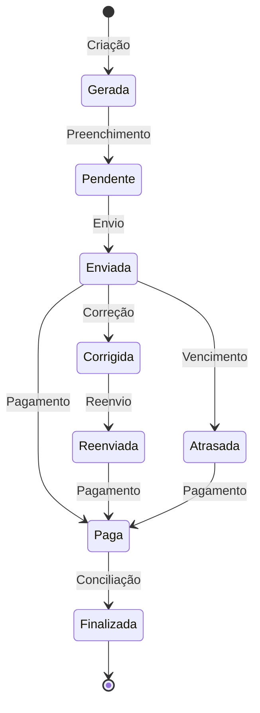

# Módulo de Faturas

## Visão Geral

O módulo de faturas gerencia o ciclo completo de faturamento dos cooperados, desde a geração automática até a aplicação de descontos e controle de pagamentos.

## Ciclo de Vida da Fatura



## Entidades Principais

### Fatura

```typescript
interface Fatura {
  id: string;
  consumo_kwh: number;
  valor_assinatura: number;
  status: FaturaStatus;
  data_vencimento: string;
  mes: number;
  ano: number;
  fatura_concessionaria: number;
  total_fatura: number;
  iluminacao_publica: number;
  outros_valores: number;
  valor_desconto: number;
  // ... outros campos
}

type FaturaStatus = 'gerada' | 'pendente' | 'enviada' | 'corrigida' | 
                    'reenviada' | 'atrasada' | 'paga' | 'finalizada';
```

## Regras de Negócio

### Cálculos Principais

- **Desconto**: `valor_desconto = (total_fatura - iluminacao_publica - outros_valores) * (percentual_desconto / 100)`
- **Assinatura**: `valor_assinatura = total_fatura - valor_desconto - fatura_concessionaria`

### Transições de Status

- Uma fatura só pode ser marcada como "paga" se estiver com status "enviada", "corrigida", "reenviada" ou "atrasada"
- Uma fatura é marcada como "atrasada" automaticamente se a data atual for posterior à data de vencimento
- Uma fatura só pode ser finalizada após confirmação de pagamento

## Componentes Principais

### FaturasContainer
Componente principal que gerencia a exibição e interação com faturas.

### FaturaEditModal
Modal para edição de faturas com cálculo automático de valores derivados.

### CurrencyInput
Componente customizado para entrada de valores monetários no padrão brasileiro.

## Hooks Principais

### useFaturas
Hook central que coordena operações CRUD e gerenciamento de estado.

```typescript
// Exemplo de uso
const { 
  faturas, 
  isLoading, 
  updateFatura, 
  gerarFaturas 
} = useFaturas(currentDate);
```

### useUpdateFatura e useUpdateFaturaStatus
Hooks específicos para atualização de faturas e seus status.

## Fluxos Operacionais

### 1. Geração de Faturas

```typescript
// Função principal de geração
async function gerarFaturasMes(mes, ano) {
  // Validação de mês futuro
  // Busca de unidades elegíveis
  // Verificação de faturas existentes
  // Criação de novas faturas
}
```

### 2. Processamento de Valores

```typescript
// Conversão de valores formatados
export const parseValue = (value: string): number => {
  if (!value) return 0;
  const cleanValue = value.replace(/\./g, '').trim();
  return parseFloat(cleanValue.replace(',', '.'));
};

// Cálculo de valores derivados
export const calculateValues = (totalFatura, iluminacaoPublica, 
                               outrosValores, faturaConcessionaria,
                               percentualDesconto) => {
  // Conversão de strings para números
  // Cálculo de desconto e valor assinatura
}
```

### 3. Envio e Acompanhamento

O sistema fornece funcionalidades para:
- Envio de faturas por e-mail ou WhatsApp
- Confirmação manual de pagamentos
- Notificações de vencimento
- Conciliação financeira

## Integrações

- **Banco de Dados**: Persistência via Supabase
- **Relatórios**: Geração de PDFs para faturas e análises
- **E-mail/WhatsApp**: Envio de faturas e notificações
- **Financeiro**: Geração de lançamentos financeiros

## Relatórios e Análises

O módulo fornece dashboards para análise de faturamento:
- Totais por status de fatura
- Tendências de pagamento
- Economia gerada para cooperados

## Próximas Melhorias

1. Integração com gateways de pagamento
2. Envio automatizado de faturas
3. Importação direta de dados da concessionária
4. Relatórios avançados de análise
5. Automação de conciliação bancária
