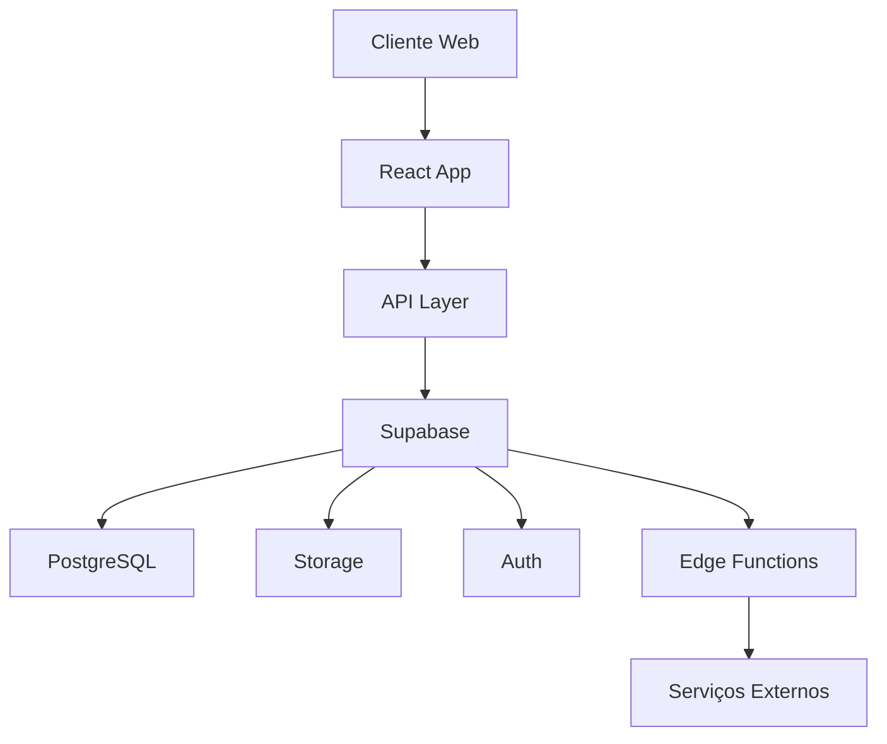

# Arquitetura do Sistema

## Visão Geral

O Solar Energy utiliza uma arquitetura moderna baseada em microserviços e serverless, focando em escalabilidade, manutenibilidade e segurança.

## Camadas do Sistema

### 1. Frontend (Cliente)

- **Framework**: React + TypeScript
- **UI Library**: shadcn/ui
- **State Management**: TanStack Query
- **Routing**: React Router
- **Estilização**: Tailwind CSS

#### Principais Características
- Single Page Application (SPA)
- Progressive Web App (PWA)
- Responsive Design
- Componentização
- Code Splitting

### 2. Backend (Serverless)

- **Plataforma**: Supabase
- **Database**: PostgreSQL
- **Authentication**: Supabase Auth
- **Storage**: Supabase Storage
- **Functions**: Edge Functions

#### Funcionalidades
- API RESTful
- Real-time subscriptions
- Row Level Security (RLS)
- Scheduled jobs
- WebHooks

### 3. Banco de Dados

#### Schemas Principais
- Public (dados da aplicação)
- Auth (autenticação)
- Storage (arquivos)

#### Características
- Relacionamentos complexos
- Triggers e functions
- Índices otimizados
- Backup automático
- Versionamento (migrations)

### 4. Serviços Externos

- **Email**: SendGrid/SES
- **Storage**: S3 Compatible
- **Monitoring**: Sentry
- **Analytics**: Google Analytics
- **Payments**: Various Gateways

## Fluxo de Dados

## Segurança

### Autenticação
- JWT Tokens
- Refresh Tokens
- Session Management
- 2FA (quando necessário)

### Autorização
- Row Level Security
- Role-Based Access Control
- Permission Management
- API Security

### Dados
- Encryption at Rest
- SSL/TLS
- Data Masking
- Audit Logs

## Escalabilidade

### Horizontal
- Stateless Components
- Load Balancing
- Connection Pooling
- Cache Distribution

### Vertical
- Resource Optimization
- Query Performance
- Lazy Loading
- Code Splitting

## Monitoramento

### Performance
- Response Times
- Resource Usage
- Query Analysis
- Cache Hit Ratio

### Disponibilidade
- Health Checks
- Error Tracking
- Usage Metrics
- Alert System

## Deployment

### Environments
- Development
- Staging
- Production

### Process
- Continuous Integration
- Continuous Deployment
- Blue/Green Deployment
- Rollback Strategy

## Considerações Técnicas

### Performance
- Edge Computing
- CDN Usage
- Query Optimization
- Cache Strategies

### Manutenibilidade
- Clean Code
- Documentation
- Testing
- Code Reviews

### Recuperação
- Disaster Recovery
- Backup Strategy
- Data Retention
- System Restore

## Próximos Passos

Para implementar novos recursos:

1. Avaliar impacto na arquitetura
2. Considerar escalabilidade
3. Manter padrões de segurança
4. Documentar mudanças
5. Testar thoroughly
