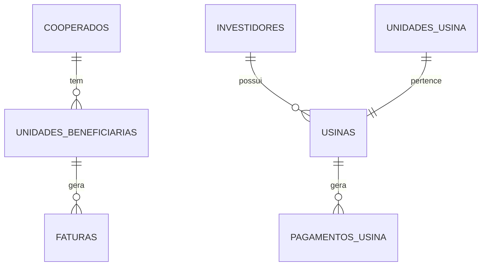

# Estrutura do Banco de Dados

## Visão Geral

O sistema utiliza PostgreSQL através do Supabase, com uma estrutura relacional otimizada para gestão de usinas fotovoltaicas e seus assinantes.

## Schemas

### Public (Dados da Aplicação)

#### Tabelas Principais

1. **cooperados**
   ```sql
   - id: uuid (PK)
   - nome: text
   - documento: text
   - tipo_pessoa: text
   - telefone: text
   - email: text
   - data_exclusao: timestamp
   - created_at: timestamp
   - updated_at: timestamp
   ```

2. **usinas**
   ```sql
   - id: uuid (PK)
   - investidor_id: uuid (FK)
   - unidade_usina_id: uuid (FK)
   - valor_kwh: numeric
   - potencia_instalada: numeric
   - status: text
   - data_inicio: date
   - created_at: timestamp
   - updated_at: timestamp
   ```

3. **unidades_beneficiarias**
   ```sql
   - id: uuid (PK)
   - cooperado_id: uuid (FK)
   - numero_uc: text
   - percentual_desconto: numeric
   - endereco: text
   - data_entrada: timestamp
   - data_saida: timestamp
   - created_at: timestamp
   - updated_at: timestamp
   ```

4. **faturas**
   ```sql
   - id: uuid (PK)
   - unidade_beneficiaria_id: uuid (FK)
   - mes: integer
   - ano: integer
   - consumo_kwh: numeric
   - valor_total: numeric
   - status: fatura_status
   - data_vencimento: date
   - created_at: timestamp
   - updated_at: timestamp
   ```

5. **pagamentos_usina**
   ```sql
   - id: uuid (PK)
   - usina_id: uuid (FK)
   - mes: integer
   - ano: integer
   - geracao_kwh: numeric
   - valor_total: numeric
   - status: pagamento_status
   - data_vencimento: date
   - created_at: timestamp
   - updated_at: timestamp
   ```

#### Enums

1. **fatura_status**
   ```sql
   - gerada
   - pendente
   - enviada
   - atrasada
   - paga
   - finalizada
   ```

2. **pagamento_status**
   ```sql
   - pendente
   - enviado
   - atrasado
   - pago
   - finalizado
   ```

#### Views

1. **cooperados_ativos**
   ```sql
   SELECT * FROM cooperados WHERE data_exclusao IS NULL
   ```

2. **usinas_ativas**
   ```sql
   SELECT * FROM usinas WHERE deleted_at IS NULL
   ```

### Auth (Autenticação)

#### Tabelas

1. **users**
   - Gerenciada pelo Supabase
   - Contém dados de autenticação

2. **profiles**
   ```sql
   - id: uuid (PK)
   - user_id: uuid (FK)
   - nome: text
   - email: text
   - empresa_id: uuid
   - created_at: timestamp
   - updated_at: timestamp
   ```

## Relacionamentos



## Índices

1. **Busca**
   ```sql
   CREATE INDEX idx_cooperados_nome ON cooperados(nome);
   CREATE INDEX idx_unidades_numero_uc ON unidades_beneficiarias(numero_uc);
   ```

2. **Performance**
   ```sql
   CREATE INDEX idx_faturas_data ON faturas(mes, ano);
   CREATE INDEX idx_pagamentos_data ON pagamentos_usina(mes, ano);
   ```

## Triggers

1. **Atualização de Status**
   - update_fatura_status
   - update_pagamento_status

2. **Histórico**
   - log_fatura_changes
   - log_pagamento_changes

## Functions

1. **Cálculos**
   ```sql
   calculate_fatura_valores(fatura_id uuid)
   calculate_pagamento_valores(pagamento_id uuid)
   ```

2. **Validações**
   ```sql
   validate_fatura_data(data json)
   validate_pagamento_data(data json)
   ```

## Políticas RLS

1. **Cooperados**
   ```sql
   CREATE POLICY "Cooperados visíveis para mesma empresa"
   ON cooperados FOR SELECT
   USING (auth.uid() IN (
     SELECT id FROM profiles WHERE empresa_id = current_user_empresa_id()
   ));
   ```

2. **Faturas**
   ```sql
   CREATE POLICY "Faturas visíveis para mesma empresa"
   ON faturas FOR SELECT
   USING (auth.uid() IN (
     SELECT id FROM profiles WHERE empresa_id = current_user_empresa_id()
   ));
   ```

## Backup e Recuperação

### Estratégia
1. Backup completo diário
2. WAL archiving contínuo
3. Retenção de 30 dias
4. Teste mensal de recuperação

### Procedimentos
1. Backup manual sob demanda
2. Restore point a cada alteração crítica
3. Documentação de cada restore

## Manutenção

### Rotinas
1. VACUUM ANALYZE mensal
2. Rebuild de índices
3. Atualização de estatísticas
4. Limpeza de dados temporários

### Monitoramento
1. Tamanho das tabelas
2. Tempo de queries
3. Bloqueios e deadlocks
4. Cache hit ratio

## Migração e Versionamento

### Processo
1. Migrations numeradas
2. Rollback para cada migration
3. Testes automatizados
4. Documentação de mudanças

### Ferramentas
1. Supabase CLI
2. Scripts de migração
3. Controle de versão
4. Ambiente de teste

## Próximos Passos

1. Otimização de queries complexas
2. Implementação de particionamento
3. Melhoria nos índices
4. Automatização de manutenção
5. Expansão de métricas
