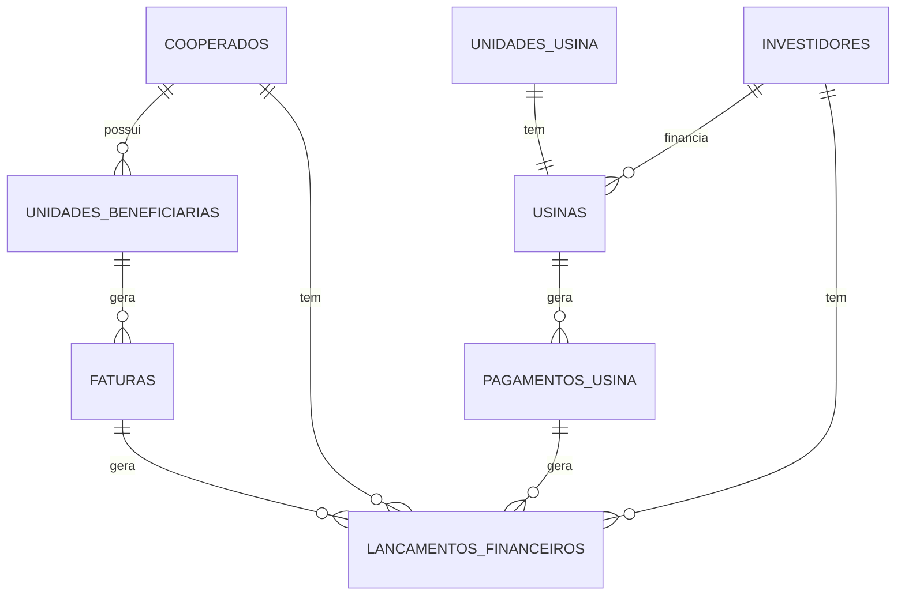

# Estrutura do Banco de Dados

## Visão Geral

O sistema utiliza PostgreSQL através do Supabase, com uma estrutura relacional otimizada para gestão de usinas fotovoltaicas e seus assinantes.

## Schemas

### Public (Dados da Aplicação)

#### Tabelas Principais

1. **cooperados**
   ```sql
   - id: uuid (PK)
   - nome: text
   - documento: text
   - tipo_pessoa: text
   - telefone: text
   - email: text
   - responsavel_nome: text
   - responsavel_cpf: text
   - responsavel_telefone: text
   - numero_cadastro: text
   - data_exclusao: timestamp
   - created_at: timestamp
   - updated_at: timestamp
   ```

2. **usinas**
   ```sql
   - id: uuid (PK)
   - investidor_id: uuid (FK)
   - unidade_usina_id: uuid (FK)
   - valor_kwh: numeric
   - potencia_instalada: numeric
   - status: text
   - data_inicio: date
   - dados_pagamento_nome: text
   - dados_pagamento_documento: text
   - dados_pagamento_banco: text
   - dados_pagamento_agencia: text
   - dados_pagamento_conta: text
   - dados_pagamento_telefone: text
   - dados_pagamento_email: text
   - dados_pagamento_chave_pix: text
   - dados_pagamento_tipo_chave_pix: text
   - created_at: timestamp
   - updated_at: timestamp
   - deleted_at: timestamp
   ```

3. **unidades_beneficiarias**
   ```sql
   - id: uuid (PK)
   - cooperado_id: uuid (FK)
   - numero_uc: text
   - apelido: text
   - percentual_desconto: numeric
   - endereco: text
   - cep: text
   - logradouro: text
   - numero: text
   - complemento: text
   - bairro: text
   - cidade: text
   - uf: text
   - data_entrada: timestamp
   - data_saida: timestamp
   - consumo_kwh: numeric
   - possui_geracao_propria: boolean
   - potencia_instalada: numeric
   - data_inicio_geracao: timestamp
   - observacao_geracao: text
   - recebe_creditos_proprios: boolean
   - uc_origem_creditos: text
   - data_inicio_creditos: timestamp
   - observacao_creditos: text
   - created_at: timestamp
   - updated_at: timestamp
   ```

4. **faturas**
   ```sql
   - id: uuid (PK)
   - unidade_beneficiaria_id: uuid (FK)
   - mes: integer
   - ano: integer
   - consumo_kwh: numeric
   - total_fatura: numeric
   - status: fatura_status
   - data_vencimento: date
   - data_pagamento: date
   - fatura_concessionaria: numeric
   - iluminacao_publica: numeric
   - outros_valores: numeric
   - valor_desconto: numeric
   - valor_assinatura: numeric
   - economia_mes: numeric
   - economia_acumulada: numeric
   - saldo_energia_kwh: numeric
   - valor_adicional: numeric
   - observacao: text
   - observacao_pagamento: text
   - data_envio: timestamp
   - data_confirmacao_pagamento: timestamp
   - historico_status: jsonb
   - send_method: text[]
   - arquivo_concessionaria_path: varchar
   - arquivo_concessionaria_nome: varchar
   - arquivo_concessionaria_tipo: varchar
   - arquivo_concessionaria_tamanho: integer
   - boleto_url: text
   - boleto_id: text
   - boleto_pdf_path: text
   - boleto_codigo_barras: text
   - boleto_linha_digitavel: text
   - created_at: timestamp
   - updated_at: timestamp
   ```

5. **pagamentos_usina**
   ```sql
   - id: uuid (PK)
   - usina_id: uuid (FK)
   - mes: integer
   - ano: integer
   - geracao_kwh: numeric
   - tusd_fio_b: numeric
   - valor_tusd_fio_b: numeric
   - valor_concessionaria: numeric
   - valor_total: numeric
   - status: pagamento_status
   - data_emissao: date
   - data_vencimento: date
   - data_vencimento_concessionaria: date
   - data_pagamento: date
   - observacao: text
   - observacao_pagamento: text
   - data_envio: timestamp
   - historico_status: jsonb
   - send_method: text[]
   - arquivo_conta_energia_nome: text
   - arquivo_conta_energia_path: text
   - arquivo_conta_energia_tipo: text
   - arquivo_conta_energia_tamanho: integer
   - created_at: timestamp
   - updated_at: timestamp
   ```

6. **lancamentos_financeiros**
   ```sql
   - id: uuid (PK)
   - tipo: tipo_lancamento
   - status: status_lancamento
   - descricao: text
   - valor: numeric
   - data_vencimento: date
   - data_pagamento: date
   - observacao: text
   - cooperado_id: uuid (FK)
   - investidor_id: uuid (FK)
   - fatura_id: uuid (FK)
   - pagamento_usina_id: uuid (FK)
   - comprovante_path: text
   - comprovante_nome: text
   - comprovante_tipo: text
   - historico_status: jsonb
   - created_at: timestamp
   - updated_at: timestamp
   - deleted_at: timestamp
   ```

#### Enums

1. **fatura_status**
   ```sql
   - gerada
   - pendente
   - enviada
   - corrigida
   - reenviada
   - atrasada
   - paga
   - finalizada
   ```

2. **pagamento_status**
   ```sql
   - pendente
   - enviado
   - pago
   - atrasado
   - cancelado
   ```

3. **tipo_lancamento**
   ```sql
   - receita
   - despesa
   ```

4. **status_lancamento**
   ```sql
   - pendente
   - pago
   - atrasado
   - cancelado
   ```

5. **user_role**
   ```sql
   - admin
   - manager
   - user
   ```

6. **integracao_ambiente**
   ```sql
   - sandbox
   - production
   ```

#### Views

1. **cooperados_ativos**
   ```sql
   SELECT * FROM cooperados WHERE data_exclusao IS NULL
   ```

2. **usinas_ativas**
   ```sql
   SELECT * FROM usinas WHERE deleted_at IS NULL
   ```

3. **metricas_financeiras**
   ```sql
   SELECT 
     date_trunc('month', data_vencimento) as mes,
     tipo,
     status,
     COUNT(*) as quantidade,
     SUM(valor) as valor_total
   FROM lancamentos_financeiros
   WHERE deleted_at IS NULL
   GROUP BY mes, tipo, status
   ```

## Triggers e Funções

### Triggers

1. **before_update_fatura**
   - Atualiza o histórico de status da fatura quando o status é alterado
   - Calcula automaticamente valores derivados (desconto, assinatura)
   - Atualiza timestamp de alteração

2. **before_update_pagamento**
   - Atualiza o histórico de status do pagamento
   - Calcula valores finais
   - Atualiza timestamp de alteração

3. **after_change_usina**
   - Registra alterações em campos importantes da usina na tabela usinas_audit

### Funções

1. **calcular_valores_fatura**
   ```sql
   CREATE OR REPLACE FUNCTION calcular_valores_fatura()
   RETURNS TRIGGER AS $$
   DECLARE
     base_desconto NUMERIC;
     percentual NUMERIC;
   BEGIN
     -- Buscar percentual de desconto
     SELECT percentual_desconto INTO percentual
     FROM unidades_beneficiarias
     WHERE id = NEW.unidade_beneficiaria_id;
     
     -- Calcular base de desconto (total - taxas)
     base_desconto := NEW.total_fatura - NEW.iluminacao_publica - NEW.outros_valores;
     
     -- Calcular valor do desconto
     NEW.valor_desconto := ROUND((base_desconto * (percentual / 100))::numeric, 2);
     
     -- Calcular valor da assinatura
     NEW.valor_assinatura := ROUND((NEW.total_fatura - NEW.valor_desconto - NEW.fatura_concessionaria)::numeric, 2);
     
     RETURN NEW;
   END;
   $$ LANGUAGE plpgsql;
   ```

2. **verificar_transicao_status_fatura**
   ```sql
   CREATE OR REPLACE FUNCTION verificar_transicao_status_fatura()
   RETURNS TRIGGER AS $$
   BEGIN
     -- Validar transições permitidas
     IF OLD.status = 'gerada' AND NEW.status NOT IN ('pendente', 'enviada') THEN
       RAISE EXCEPTION 'Transição de status não permitida: % para %', OLD.status, NEW.status;
     END IF;
     
     -- Outras validações...
     
     -- Registrar histórico
     IF OLD.status <> NEW.status THEN
       NEW.historico_status := OLD.historico_status || 
         jsonb_build_object(
           'status', NEW.status,
           'data', NOW(),
           'status_anterior', OLD.status
         );
     END IF;
     
     RETURN NEW;
   END;
   $$ LANGUAGE plpgsql;
   ```

## Integridade Referencial

### Relacionamentos Principais



### Restrições de Chave Estrangeira

1. **unidades_beneficiarias**
   ```sql
   CONSTRAINT fk_unidades_cooperado
     FOREIGN KEY (cooperado_id)
     REFERENCES cooperados(id)
     ON DELETE RESTRICT
   ```

2. **faturas**
   ```sql
   CONSTRAINT fk_faturas_unidade
     FOREIGN KEY (unidade_beneficiaria_id)
     REFERENCES unidades_beneficiarias(id)
     ON DELETE RESTRICT
   ```

3. **usinas**
   ```sql
   CONSTRAINT fk_usinas_investidor
     FOREIGN KEY (investidor_id)
     REFERENCES investidores(id)
     ON DELETE RESTRICT,
   CONSTRAINT fk_usinas_unidade
     FOREIGN KEY (unidade_usina_id)
     REFERENCES unidades_usina(id)
     ON DELETE RESTRICT
   ```

## Índices

1. **Performance**
   ```sql
   -- Faturas
   CREATE INDEX idx_faturas_unidade ON faturas(unidade_beneficiaria_id);
   CREATE INDEX idx_faturas_mes_ano ON faturas(mes, ano);
   CREATE INDEX idx_faturas_status ON faturas(status);
   
   -- Pagamentos
   CREATE INDEX idx_pagamentos_usina ON pagamentos_usina(usina_id);
   CREATE INDEX idx_pagamentos_mes_ano ON pagamentos_usina(mes, ano);
   CREATE INDEX idx_pagamentos_status ON pagamentos_usina(status);
   
   -- Lançamentos
   CREATE INDEX idx_lancamentos_tipo ON lancamentos_financeiros(tipo);
   CREATE INDEX idx_lancamentos_status ON lancamentos_financeiros(status);
   CREATE INDEX idx_lancamentos_vencimento ON lancamentos_financeiros(data_vencimento);
   ```

2. **Busca**
   ```sql
   -- Cooperados
   CREATE INDEX idx_cooperados_nome ON cooperados(nome);
   CREATE INDEX idx_cooperados_documento ON cooperados(documento);
   
   -- Unidades
   CREATE INDEX idx_unidades_uc ON unidades_beneficiarias(numero_uc);
   CREATE INDEX idx_unidades_nome ON unidades_beneficiarias USING gin(to_tsvector('portuguese', apelido));
   ```

## Row Level Security (RLS)

Para garantir isolamento de dados entre empresas diferentes no ambiente multi-tenant:

```sql
-- Política para cooperados
CREATE POLICY empresa_isolation_cooperados ON cooperados
FOR ALL
USING (empresa_id = current_setting('app.current_empresa_id')::uuid);

-- Política para faturas (através de unidades beneficiárias)
CREATE POLICY empresa_isolation_faturas ON faturas
FOR ALL
USING (
  unidade_beneficiaria_id IN (
    SELECT id FROM unidades_beneficiarias WHERE empresa_id = current_setting('app.current_empresa_id')::uuid
  )
);

-- Outras políticas semelhantes para as demais tabelas
```

## Ciclo de Vida dos Dados

### 1. Backup e Retenção

- Backup automático diário do banco completo
- Retenção de 30 dias para backups diários
- Retenção de 12 meses para backups mensais
- Backup sob demanda antes de grandes alterações

### 2. Arquivamento

- Faturas e lançamentos com mais de 5 anos são arquivados em tabelas históricas
- Dados de cooperados excluídos são anonimizados após 6 meses

### 3. Auditoria

- Registro de todas alterações em dados críticos (usinas, pagamentos, faturas)
- Registro de ações administrativas
- Logs de acesso a dados sensíveis

## Otimização de Consultas

### 1. Materialized Views

```sql
CREATE MATERIALIZED VIEW resumo_mensal_faturas AS
SELECT 
  date_trunc('month', data_vencimento) as mes,
  status,
  COUNT(*) as quantidade,
  SUM(valor_assinatura) as valor_total,
  SUM(valor_desconto) as desconto_total
FROM faturas
GROUP BY mes, status;

-- Atualização automática
CREATE FUNCTION refresh_mat_views()
RETURNS TRIGGER AS $$
BEGIN
  REFRESH MATERIALIZED VIEW CONCURRENTLY resumo_mensal_faturas;
  RETURN NULL;
END;
$$ LANGUAGE plpgsql;
```

### 2. Particionamento

Para tabelas que crescem continuamente, como faturas e pagamentos:

```sql
-- Particionamento de faturas por ano
CREATE TABLE faturas (
  id uuid PRIMARY KEY,
  -- outros campos
  ano integer NOT NULL
) PARTITION BY RANGE (ano);

-- Criar partições
CREATE TABLE faturas_2023 PARTITION OF faturas FOR VALUES FROM (2023) TO (2024);
CREATE TABLE faturas_2024 PARTITION OF faturas FOR VALUES FROM (2024) TO (2025);
```

## Próximos Passos

1. Implementar mais índices para consultas frequentes
2. Otimizar consultas complexas com materialized views
3. Implementar cache para dados de referência
4. Expandir particionamento para outras tabelas
5. Adicionar mais validações a nível de banco
